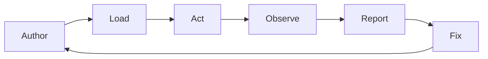
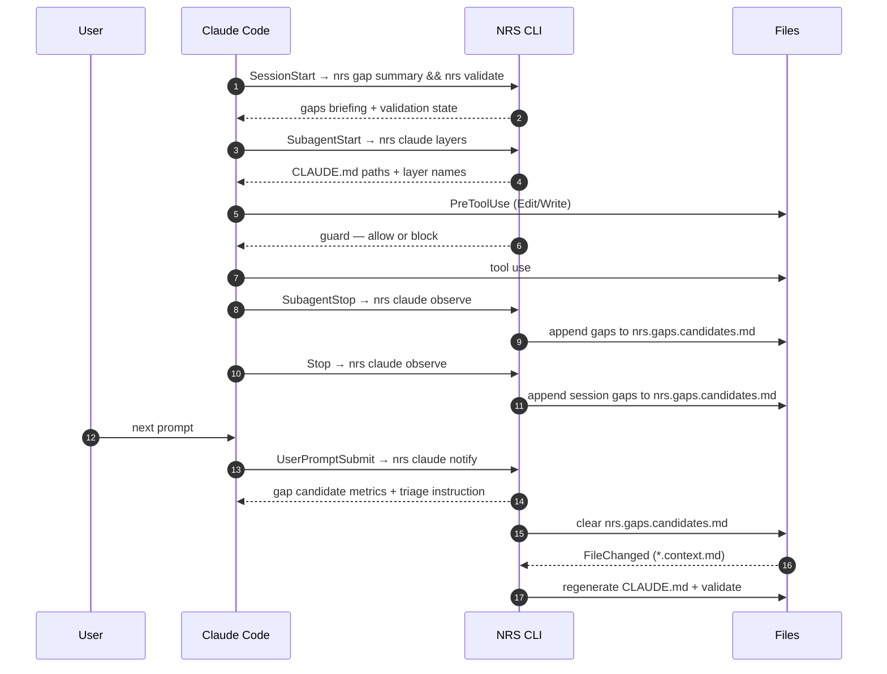

import { Aside, Card, CardGrid } from '@astrojs/starlight/components';

NRS is not a static documentation system. It is a feedback loop. Context is authored, loaded into an agent, acted on, observed under real use, and refined when gaps surface. Each turn tightens the fit between what the context says and what the codebase actually requires.

## The Loop

Six stages. Each has a human-facing purpose and a mechanism.

<CardGrid>
  <Card title="1 · Author" icon="pencil">Humans write layered `*.context.md` files.</Card>
  <Card title="2 · Load" icon="open-book">Agents discover context on entering an area.</Card>
  <Card title="3 · Act" icon="rocket">Agents execute with that context in memory.</Card>
  <Card title="4 · Observe" icon="magnifier">The system watches for struggle signals.</Card>
  <Card title="5 · Report" icon="warning">Gaps surface in `nrs.gaps.md`.</Card>
  <Card title="6 · Fix" icon="approve-check">Context is patched; the loop continues.</Card>
</CardGrid>

### Author

Humans write `*.context.md` files, one per layer, co-located with what they describe. Size ceilings, reference rules, and anti-coupling constraints apply — see [Context Layers](/nrs/concepts/layers/) and [Rules](/nrs/concepts/rules/). `nrs validate` enforces them on every commit via the precommit hook.

### Load

Every directory with context files gets a generated tool entry point (`CLAUDE.md` for Claude Code, `.cursorrules` for Cursor, etc.). Agents load the entry point matching their current directory. Inner layers stack on outer ones — a subagent descending into `src/billing/` loads the root `CLAUDE.md` plus `src/billing/CLAUDE.md`.

### Act

The agent executes with layered context in memory. `nrs.context.md` sets the operating rules — propose first, report gaps, use sub-agents for multi-domain work. Generated outputs are guarded from direct edits.

### Observe

Struggle is a signal that context is missing or wrong. NRS tracks five patterns across agent transcripts:

| Pattern | Signal | Gap type |
|---|---|---|
| `excessive-reads` | 5+ source files read in a directory without writing | `missing-context` / `missing-pattern` |
| `no-context` | 3+ file operations in a directory without `*.context.md` | `missing-context` |
| `re-reads` | Same file read 3+ times | `missing-pattern` |
| `backtracking` | Write → multiple reads → rewrite same file | `missing-pattern` |
| `user-correction` | User correction markers followed by file writes | `wrong` |

### Report

Detected gaps are staged in `nrs.gaps.candidates.md` with source `observed:<pattern>`. At the next user prompt, `notify` surfaces them to the agent as a self-contained summary with triage instructions, then clears the staging file. Agents can also report confirmed gaps manually via `nrs gap report` — those land directly in `nrs.gaps.md` with `source: manual`. Duplicates are preserved so frequency signals priority.

### Fix

Humans (or agents, via the `nrs-fix` skill) read the summary, patch the underlying context file, and remove the gap row. The fix feeds back into the Load stage on the next session. Over time, the loop converges: fewer gaps, fewer signals, less agent struggle.

<Aside type="tip">The loop is the product. Gaps are not failures — they are the mechanism by which context stays current.</Aside>

## Claude Code Implementation

In Claude Code, each lifecycle stage is backed by concrete hook events installed by `nrs generate claude`. The hooks wire the loop into the IDE without any explicit agent coordination.

| Stage | Hook | Command | Role |
|---|---|---|---|
| Load | `SessionStart` | `nrs gap summary && nrs validate` | Briefing: open gaps + validation state |
| Load | `SubagentStart` | `nrs claude layers --hook-mode` | Layer orientation for new subagents |
| Load | `PostCompact` | `nrs claude layers --hook-mode` | Re-inject layer paths after compaction |
| Act | `PreCompact` | `nrs claude layers --hook-mode` | Forward layer paths before compaction |
| Act | `PreToolUse` (Edit\|Write) | `nrs claude guard --hook-mode` | Block edits to generated files |
| Observe | `SubagentStop` | `nrs claude observe --hook-mode` | Signal detection on subagent transcript |
| Observe | `Stop` / `StopFailure` | `nrs claude observe --hook-mode` | Signal detection on session transcript |
| Report | `UserPromptSubmit` | `nrs claude notify --hook-mode` | Surface gap candidates with triage instructions |
| Fix | `FileChanged` (`*.context.md`) | `nrs generate claude && nrs validate` | Regenerate and re-validate on every edit |

Ten hooks, one loop. See [Commands](/nrs/cli/commands/#hooks) for the reference table with exact JSON matchers.

### Session Timeline

A single Claude Code session runs the loop end-to-end:

### Why Each Hook Matters

- **`SessionStart`** greets the agent with what is known to be broken. No prompt archaeology.
- **`SubagentStart` / `PreCompact` / `PostCompact`** keep layer awareness alive across context boundaries — subagents and compaction both erase working memory; these hooks restore the map.
- **`PreToolUse`** enforces the invariant that generated files are never hand-edited. If an agent tries, it is redirected to `nrs gap report`.
- **`SubagentStop` / `Stop` / `StopFailure`** run the observer on both subagent and main transcripts, so struggle anywhere in the session is captured. Detected gaps are staged in `nrs.gaps.candidates.md`.
- **`UserPromptSubmit`** closes the loop organically: at the next user prompt, the agent receives a self-contained summary of gap candidates with metrics and triage instructions — either delegate to a background sub-agent or ignore.
- **`FileChanged`** ensures authored context and generated outputs never diverge. Editing any `*.context.md` regenerates every affected entry point and re-runs validation.

## Closing

The loop is the product. Upfront-perfect context does not exist — every codebase drifts faster than humans can document. NRS replaces the goal of perfection with the goal of tight iteration: observe where agents struggle, surface the gap, fix the context, repeat. The Claude Code hooks are how that loop runs automatically inside a working IDE.
